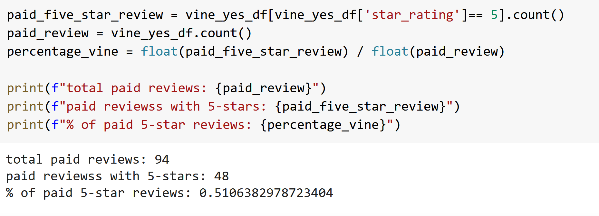
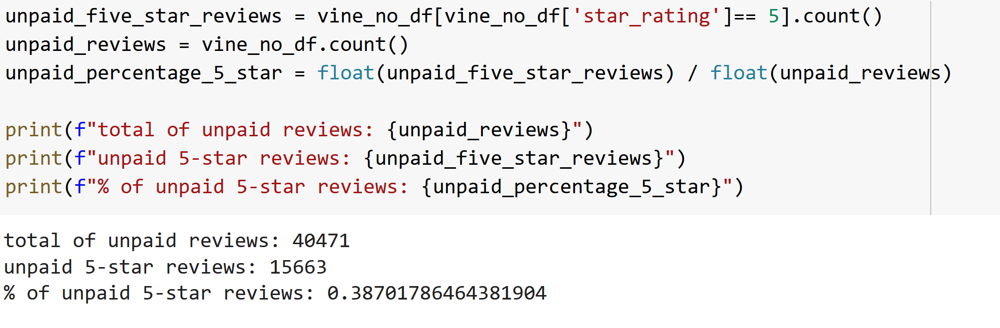

# Amazon_Vine_Analysis

## Overview

The goal of this task is to audit the Amazon Vine service and get the understanding if there is any positivity bias for reviews in the Vine program. 

## Results

### Paid reviews

_________________________________________________________________________________________________________________________________________________________________________

### UnPaid reviews

## Summary

The bias is highly possible. The non vine/vine reviews ratio is 40471/94. In addition, vine reviews got 5 stars rate in 51% of all reviews while non vine got 5 stars in 38% of all reviews. Using this number we can conclude that vine reviews are more inclined to leave a positive review to a product. For the next research we can find the mean of the paid and unpaid reviews to understand how many stars vine and non vine members leave in product review.
